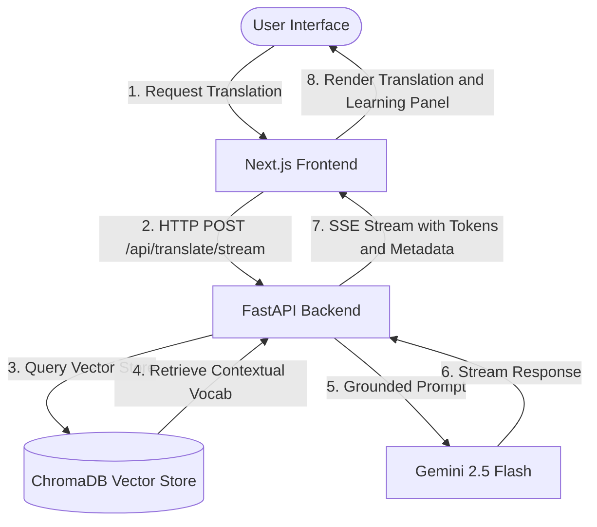

# Dayak Kenyah Translate Web App

A RAG-powered (Retrieval-Augmented Generation) translation platform designed to translate text between **Dayak Kenyah** (an Austronesian language spoken in Borneo) and **Indonesian** (or other languages). 

This project bridges the gap for low-resource languages by combining a local vector database of curated dictionaries with the advanced linguistic capability of Google's Gemini models to provide contextually accurate translations, complete with grammar analysis, word-by-word breakdowns, and usage examples.

---

## 🏗️ Architecture Overview

The application is split into two main parts:
1. **Frontend (`/frontend`)**: A modern, sleek Next.js (React) web interface featuring a real-time translation area, progressive text-streaming, and an educational workspace displaying syntax analyses and language facts.
2. **Backend (`/backend`)**: A FastAPI Python server handling document processing, semantic search query matching via ChromaDB, and prompt engineering using the Gemini API.



---

## ✨ Features

- **RAG-Grounded Translation**: Retrieves relevant glossary/dictionary records locally using ChromaDB semantic search, embedding queries using a local model (`all-MiniLM-L6-v2`) and feeding matching entries directly to Gemini. This prevents translation hallucination.
- **Server-Sent Events (SSE)**: Streams translation output dynamically so users see results as they are being generated.
- **SQLite Cache**: Transparently caches translations to optimize response speeds, eliminate redundant LLM calls, and minimize Gemini API usage.
- **Dictionary Uploader**: Processes and ingests dictionary files (`.pdf`, `.docx`, `.csv`) directly from the UI, converting them into embedded documents stored persistently inside ChromaDB.
- **Linguistic Educational Hub**: Provides granular outputs, including:
  - **Word Breakdown**: Explains part-of-speech and definitions for individual words.
  - **Grammar Explanation**: Highlighting syntax rules, prefixes, and suffixes.
  - **Similar Examples**: Shows corresponding contextual phrases.
  - **Fun Facts**: Fascinating details about the history and usage of Kenyah culture/language.

---

## 📁 Repository Structure

```text
├── backend/
│   ├── data/                 # SQLite Cache & ChromaDB storage
│   ├── rag/                  # Core RAG modules
│   │   ├── cache.py          # SQLite translation cache
│   │   ├── document_processor.py  # PDF, Word, CSV parser and chunker
│   │   ├── prompts.py        # System prompt structure
│   │   ├── translator.py     # Gemini orchestration layer
│   │   └── vector_store.py   # ChromaDB client & local embeddings
│   ├── main.py               # FastAPI router and endpoints
│   ├── requirements.txt      # Python dependencies
│   └── cek_api.py            # Utility script for API Key validation
├── frontend/
│   ├── app/                  # Next.js App Router (Layouts & Main view)
│   ├── components/           # UI Components (Translate panel, Upload, Breakdown)
│   ├── public/               # Static assets
│   ├── package.json          # Node dependencies & script mappings
│   └── README.md             # Frontend-specific documentation
└── README.md                 # Main Project Documentation (this file)
```

---

## 🚀 Setup & Installation

### 1. Prerequisites
- **Python**: version `3.10` or newer.
- **Node.js**: version `18` or newer.
- **Gemini API Key**: Obtain a key from the [Google AI Studio](https://aistudio.google.com/).

---

### 2. Backend Setup
1. Move to the `backend` directory:
   ```bash
   cd backend
   ```

2. Create a virtual environment:
   ```bash
   # On Windows
   python -m venv venv
   .\venv\Scripts\activate
   
   # On macOS/Linux
   python3 -m venv venv
   source venv/bin/activate
   ```

3. Install dependencies:
   ```bash
   pip install -r requirements.txt
   ```

4. Configure Environment Variables:
   - Duplicate `.env.example` and rename it to `.env`.
   - Add your Gemini API key:
     ```env
     GEMINI_API_KEY=your_gemini_api_key_here
     ```

5. Validate your environment credentials (optional):
   ```bash
   python cek_api.py
   ```

6. Start the FastAPI backend server:
   ```bash
   uvicorn main:app --reload --port 8000
   ```
   The backend API will be available at `http://localhost:8000`. You can inspect the interactive OpenAPI documentation at `http://localhost:8000/docs`.

---

### 3. Frontend Setup
1. Move to the `frontend` directory:
   ```bash
   cd ../frontend
   ```

2. Install Node modules:
   ```bash
   npm install
   ```

3. Run the development server:
   ```bash
   npm run dev
   ```
   Open `http://localhost:3000` in your web browser to access the user interface.

---

## 🔌 API Reference

The backend exposes the following REST endpoints:

| Method | Endpoint | Description |
| :--- | :--- | :--- |
| **POST** | `/api/translate` | Standard JSON translate request. |
| **POST** | `/api/translate/stream` | Streams translation and education metadata via Server-Sent Events (SSE). |
| **POST** | `/api/upload-dictionary` | Ingests a `.pdf`, `.docx`, or `.csv` dictionary file, embedding and saving it to the vector store. |
| **GET** | `/api/dictionary-status` | Returns whether a dictionary collection has been populated, along with the total entry count. |
| **GET** | `/api/health` | Diagnostic status check checking the vector store status and timestamp. |
| **GET** | `/api/cache-stats` | Aggregates SQLite cache status details (entries, hit ratios). |
| **DELETE** | `/api/cache` | Purges all saved cached items from the SQLite repository database. |

---

## 🛠️ Tech Stack Details

- **Backend Logic**: [FastAPI](https://fastapi.tiangolo.com/) (Fast, asynchronous Python API framework)
- **Large Language Model**: [Google Gemini 2.5 Flash](https://ai.google.dev/) via the modern `google-genai` SDK
- **Vector Database**: [ChromaDB](https://www.trychroma.com/) (Local persistent storage for semantic vector retrieval)
- **Local Embeddings**: `all-MiniLM-L6-v2` model executed on CPU (completely free, offline)
- **Document Extractors**: [PyMuPDF](https://pymupdf.readthedocs.io/) (for PDF dictionaries) & [python-docx](https://python-docx.readthedocs.io/) (for Word documents)
- **Frontend App**: [Next.js 16 (React 19)](https://nextjs.org/) utilizing CSS Modules and fully responsive modern layout aesthetics.
